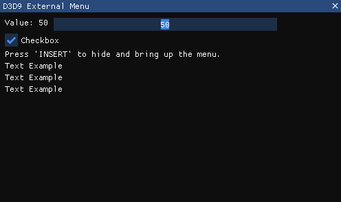

# D3D9-External-Menu
This is an external, borderless, topmost overlay which can be used for many purposes, such as game hacking. It is built on ImGui.

  

## Features

- **Low Level Global Keyhook:** Can be used to setup other features, e.g. F5 to toggle a function.
- **Top Most Overlay:** Menu overlays above all other windows, as long as they are not fullscreen.
- **Listens for INS Key:** To hide and bring up the menu.

## Usage

- **Clone the repo**
- **Build in x86 Release**
- **Open the .exe**

## Important!

- **Adapted From:** 
- **borderless-imgui-window** https://github.com/cazzwastaken/borderless-imgui-window

## License

The MIT License lets you do almost anything you want with this project, even making and distributing closed source versions.

